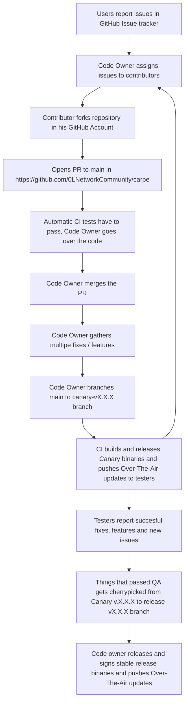

# Carpe - Development flow

```mermaid
graph TD;
   K[Users report issues in GitHub Issue tracker] --> L[Code Owner assigns issues to contributors]
    L --> A
    A[Contributor forks repository in his GitHub Account] --> B[Opens PR to main in https://github.com/0LNetworkCommunity/carpe ] --> C[Automatic CI tests have to pass, Code Owner goes over the code]
    C --> D[Code Owner merges the PR]
    D --> E[Code Owner gathers multipe fixes / features]
    E --> F[Code Owner branches main to canary-vX.X.X branch]
    F --> G[CI builds and releases Canary binaries and pushes Over-The-Air updates to testers]
    G --> H[Testers report succesful fixes, features and new issues]
    G --> L
    H --> I[Things that passed QA gets cherrypicked from Canary v.X.X.X to release-vX.X.X branch]
    I --> J[Code owner releases and signs stable release binaries and pushes Over-The-Air updates]
```
