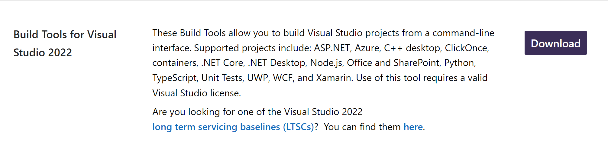
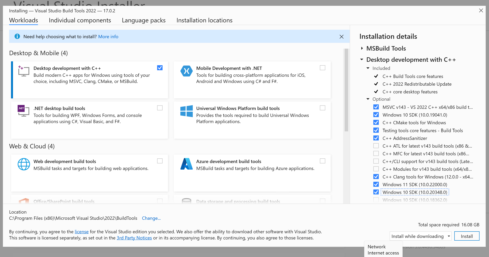
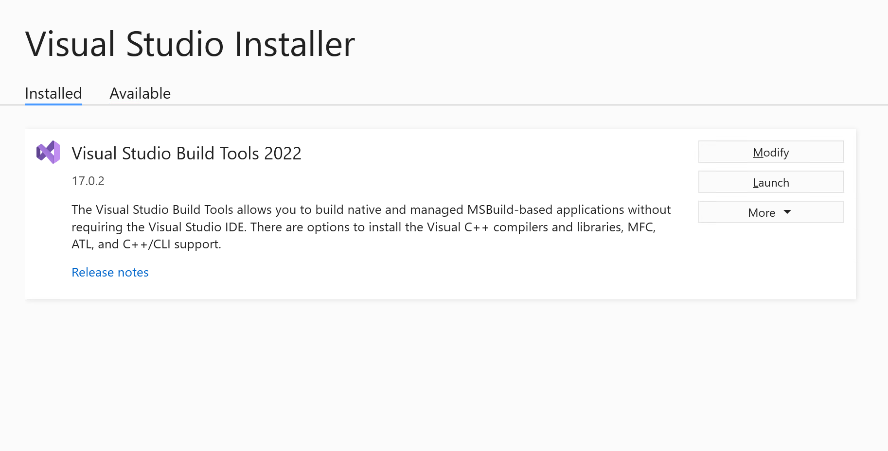
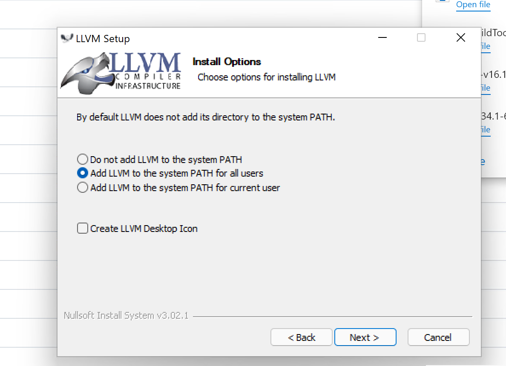
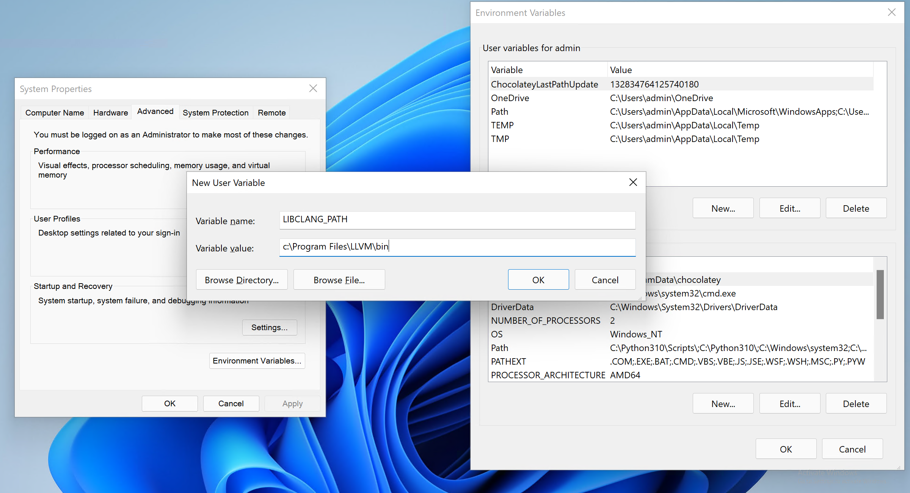
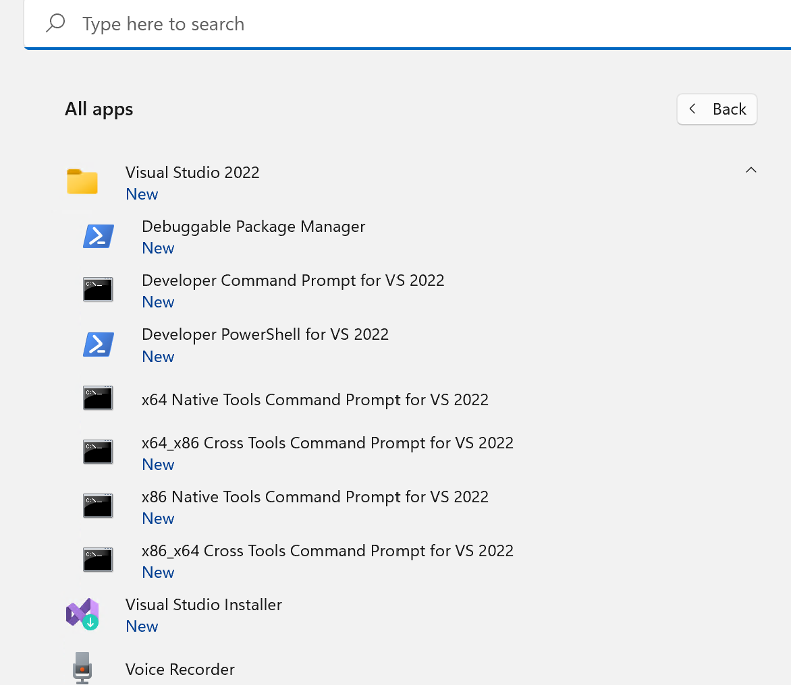
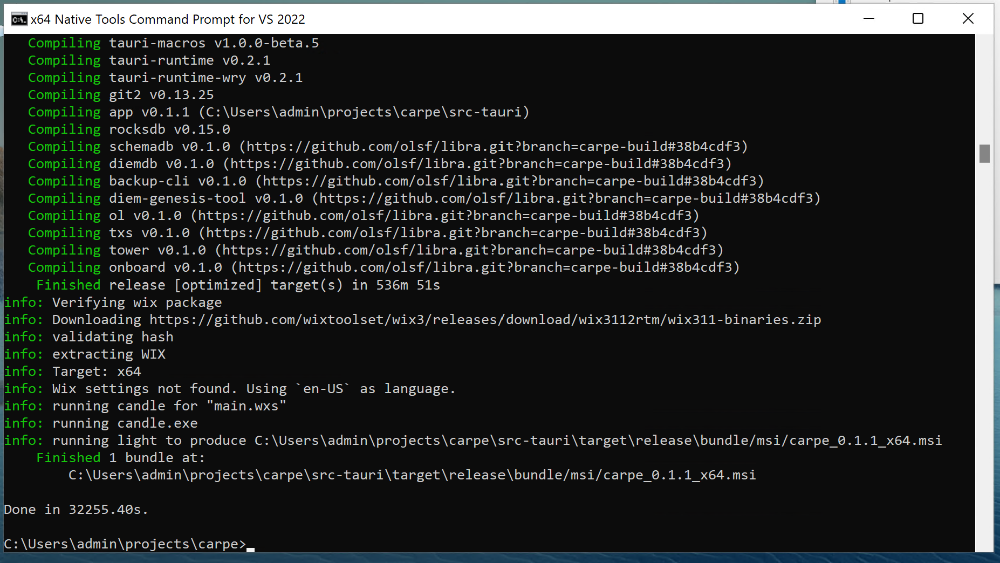

# Windows Development Environment Setup

Successfully building Carpe for Windows requires a specific mix of installed tools and configuration that is not detailed completely in the Tauri docs. In addition, Carpe's Rust code requires its own special tools and config in addition to that needed for Tauri. These instructions assume, and were tested on, a "stock" Windows 11 installation, but should work on Windows 10 too, and are intended to be usable by those with only minimal knowledge of Windows.

```
Note: while it is common to use a Unix-like environment such as Cygwin or WSL
for development on Windows, this approach won't work at present for Tauri app
builds because they depend on using the Microsoft compiler and Windows SDK
which are currently only available hosted on native Windows.
```
## Step 1: Install Git
Note: if you already have working git on the machine, this step can be skipped.

Download and install from here: [https://git-scm.com/download/win](https://git-scm.com/download/win)

Choose all default answers to the questions asked during installation. 

Post-install, verify that git was installed by opening a "CMD" shell and running `git`. You should see some help output from git.  
## Step 2: Install Node.js
Download and install from here: [https://nodejs.org/en/download/](https://nodejs.org/en/download/)

Note that Tauri requires Note 16 (the current LTS). Download the "Windows Installer" (.msi) package and install. Choose the default answers to questions asked, including to install the necessary tools which will in turn install chocolatey (a package manager similar to brew, but for Windows).

Post-install verify that Node.js was installed by opening a "CMD" shell window and running `node --version`. You should see node's version printed (which should be 16.x.x).
## Step 3: Install yarn
Yarn is installed using chocolatey (installed by the Node.js installer in step 2). Note that it needs to be run with elevated privileges. The easiest way to do this is to open a "CMD" shell window using "Run as Administrator".

In the administrator shell, run:
```
choco install yarn
```
You should see a bunch of confused-looking output that ends with somethign about having installed yarn. It can be hard to tell if this output is reporting an error or success. Post-install verify that yarn was installed by opening a new "CMD" shell window and running `yarn --version`. You should see yarn's version printed.
## Step 4 : Install MS Compiler and Tools
Microsoft ships a compiler toolchain that runs entirely from the command line, similar to gcc or clang on Linux. This is called "Build Tools for Visual Studio". Confusing because it exists specificially to allow development _without_ Visual Studio. The "BTFVS" has a complex installation process. First go to the download page which tends to move around, but at time of writing is here: [https://visualstudio.microsoft.com/downloads/#build-tools-for-visual-studio-2022](https://visualstudio.microsoft.com/downloads/#build-tools-for-visual-studio-2022). You're looking for a download choice that looks like this:

[](win-screen-shot-1.png)

Click download and run the downloaded file. This will open a 747-cockpit-UI installer that looks like the screen shot below. Now, proceed carefully: select "Desktop development with C++", but then additionally select the various checkboxes on the right as shown below (these are not the defaults):

[](win-screen-shot-2.png)

After some time you should see the installer display somethign like the screen shot below. You can now exit the installer.

[](win-screen-shot-3.png)
## Step 5: Install LLVM
The LLVM toolchain must be downloaded and installed from here: [https://github.com/llvm/llvm-project/releases/tag/llvmorg-13.0.0](https://github.com/llvm/llvm-project/releases/tag/llvmorg-13.0.0)

Select add to the system PATH as shown here:

[](win-screen-shot-4.png)
## Step 6: Set LLVM Environment Variable
The environment variable `LIBCLANG_PATH` must be set to `c:\Program Files\LLVM\bin`

The easiest way to do this is with the control panel as shown below:

[](win-screen-shot-6.png)
## Step 6: Install Rust
Install the latest Rust toolchain by visiting this URL in a browser then running the downloaded file: [https://win.rustup.rs/x86_64](https://win.rustup.rs/x86_64)

## Step 7: Open a Development Shell
The MS compiler toolchain requires various environment variables set correctly. The easiest way to achieve this is to open a shell using a shortcut, several of which were installed in step 4. You should see these in the apps list, under a "Visual Studio" folder as shown in the screen shot below. Select the appropriate shell for your machine (usually "x64 Native Tools Command Prompt for VS 2022").

[](win-screen-shot-5.png)

## Step 8: Build
Carpe can now be cloned from GitHub and built, in the shell opened in step 7, with the same commands as used for the Linux and MacOS builds:
```
git clone [git@github.com:OLSF/carpe.git](https://github.com/OLSF/carpe.git)
cd carpe
cd cd src-tauri
cargo build
cd ..
yarn
yarn tauri dev
```
The build takes some time, particularly the Rust phase. Eventually you should see output like this, indicating that an installable package (`.msi` file) has been generated:

[](win-screen-shot-7.png)
[
## Step 9: Relax and enjoy your new Carpe