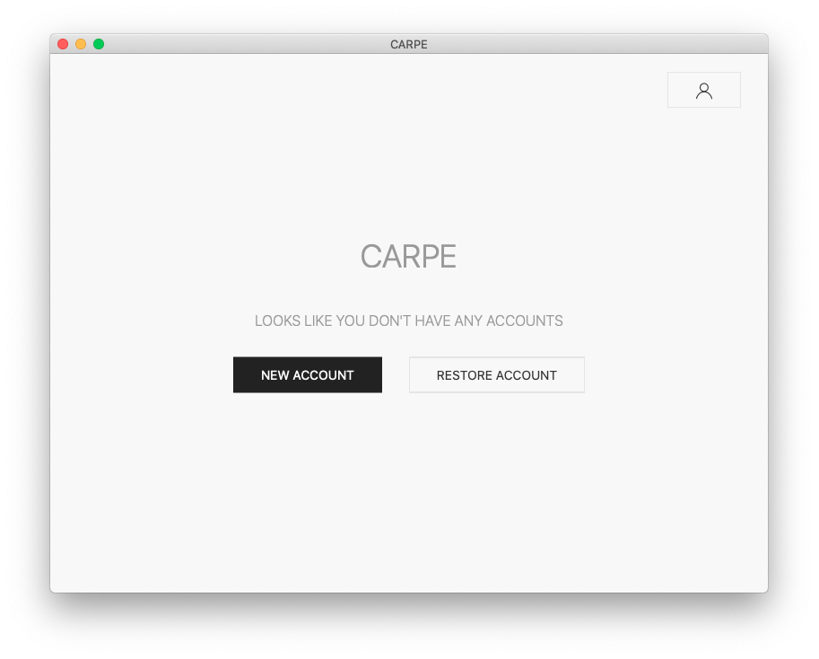
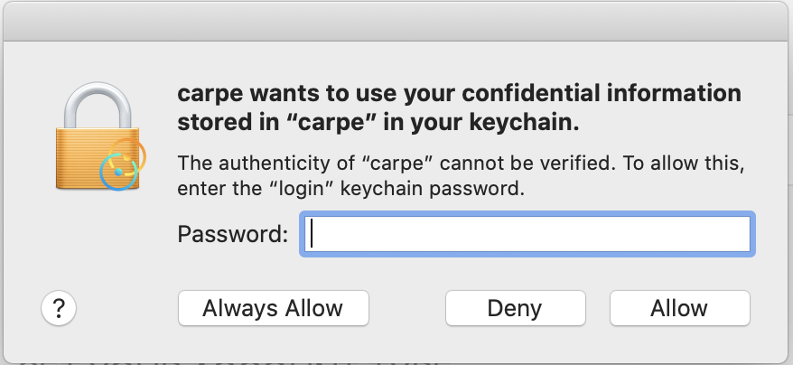
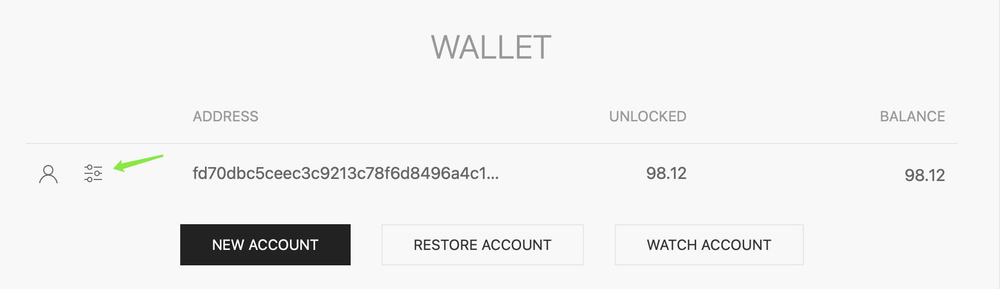
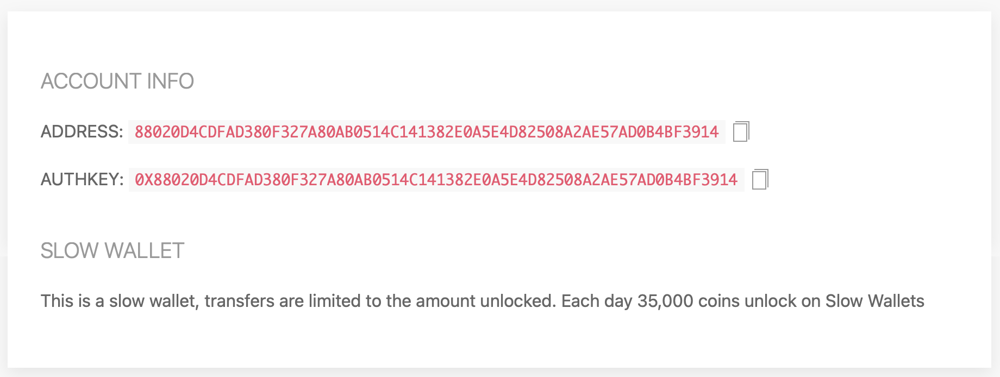
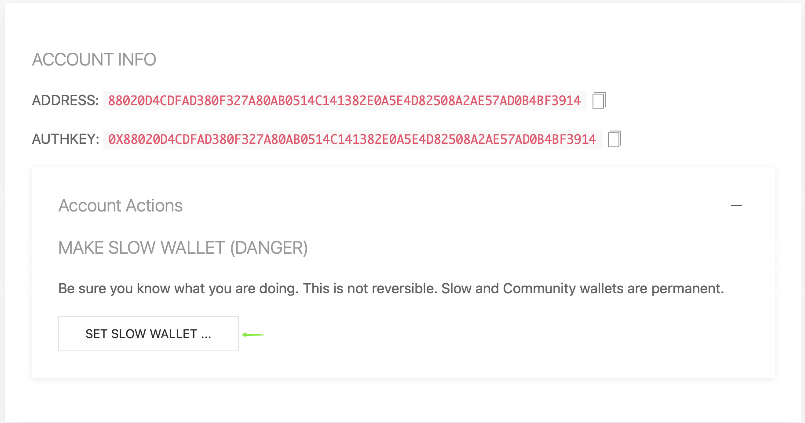

# Usage of Carpe

## Initial start

After successful installation and first start, you should see an initial screen, which let's you create your account:

## Create an account

If this is your first usage, you should just click on "new account" and then on "generate keys". You can click on "generate keys" as often as you like until you are happy with the proposed account number.

Then please write down the ACCOUNT ADDRESS, AUTH KEY and the RECOVERY PHRASE.

This is essential, as otherwise you will very likely loose your earned coins.

After writing this down, click on "submit".

## About private keys

Since Carpe needs to send transactions to the blockchain, it will need a private key (which is derived from the mnemonic above). Carpe stores the private key on the OS "keyring", as is the best practice for wallets.

On MacOS you will be prompted for your OS login password (on Windows and Ubuntu you may be prompted based on your settings). As you can see from the instructions, this authorization is only used to read and write to the Carpe Keystore.

## Get onboard

Until you can use the newly created account, you need some 0L user who "onboards" you. Please send the displayed "authkey" to this person.

After the onboarding transaction has been done, the wallet will show some BALANCE for your account and no longer the text "Account not on chain".

If you don't yet have a friend on 0L, come to the [Discord Server](https://discord.gg/AzCp63pggW) and send your 0L public adress in the onboarding channel.

## DANGER

There are some dangerous buttons on the "TRANSACTIONS" and "SETTINGS" screens. Don't use them until you know what they do.

## SlowWallet
How to set your wallet as a slow wallet  
**Wallet balance must be maintained at least 10 Libra**

***Note that this operation is irreversible, please do not use this feature unless you know what you are doing!***

Click on the Settings icon to the left of the wallet address you want to set.

If you already have a slow wallet, clicking on the Settings icon will show you the following image  

If it is not a slow wallet, click on the setup icon will be displayed as shown below, then click on the `SET SLOW WALLET` button, the system pops up the authorization, waiting for a successful transaction    

If you have any problems with the process, please feel free to come to [Discord Server](https://discord.gg/AzCp63pggW) for feedback. 

